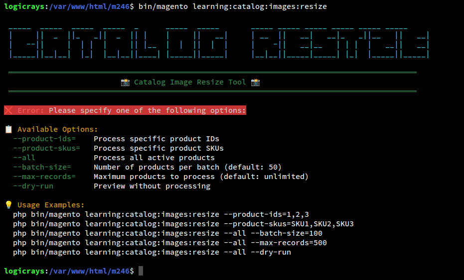
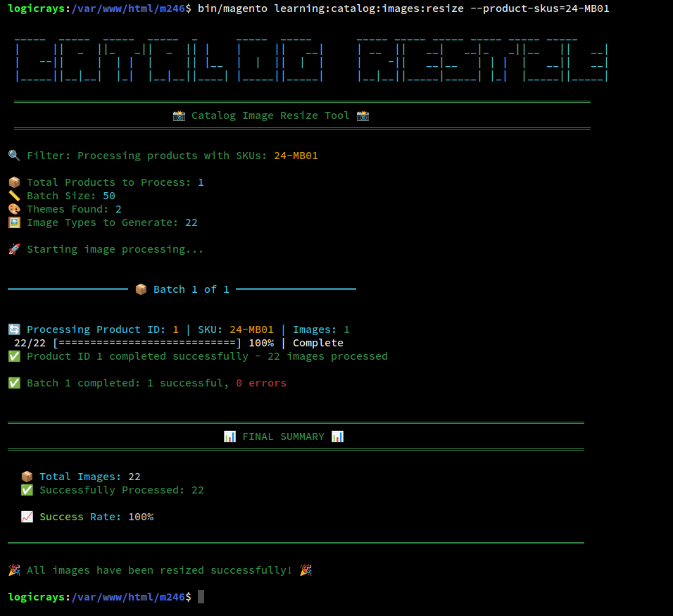

# Learning_CatalogImageResize

A Magento 2 module that provides an advanced CLI command to resize product catalog images for all configured image types and themes.



## Table of Contents

- [Features](#features)
- [Requirements](#requirements)
- [Installation](#installation)
- [Usage](#usage)
- [Options](#options)
- [Examples](#examples)
  - [Product ID Range Examples](#product-id-range-examples)
- [Screenshots](#screenshots)
- [Comparison with Native Command](#comparison-with-native-command)
- [Troubleshooting](#troubleshooting)
- [Performance Tips](#performance-tips)
- [License](#license)

## Features

- 📸 **Advanced CLI Command**: Comprehensive command-line interface for image processing
- 🔍 **Flexible Filtering**: Process products by IDs, SKUs, or all active products
- 🧪 **Dry Run Mode**: Preview what will be processed without making changes
- 📊 **Batch Processing**: Process products in configurable batch sizes for memory efficiency
- 🎯 **Max Records Limit**: Control the number of products to process
- 📈 **Progress Tracking**: Real-time progress bars with detailed status messages
- ✅ **Comprehensive Statistics**: Track successes, failures, and skipped images with success rate
- 🎨 **Beautiful UI**: Colorful output with emojis for enhanced readability
- ❌ **Error Handling**: Comprehensive error reporting with detailed messages
- 🖼️ **Theme Support**: Automatically processes images for all active themes
- 💧 **Watermark Support**: Applies configured watermarks automatically
- 📋 **Detailed Summary**: Final summary with complete error details
- 🏗️ **Magento Standards**: Follows PSR-2 and Magento 2 coding standards
- 💉 **Proper Architecture**: Uses dependency injection, no ObjectManager
- ✨ **Wide Compatibility**: Works with Magento 2.4.4 to latest versions

## Requirements

- **PHP**: 8.1, 8.2, or 8.3
- **Magento**: 2.4.4 or later
- **Required Modules**:
  - Magento_Catalog
  - Magento_Store
  - Magento_Theme

## Installation

### Step 1: Copy Module Files

```bash
# Navigate to Magento root directory
cd /path/to/magento/root

# Create module directory
mkdir -p app/code/Learning/CatalogImageResize

# Copy module files to the directory
# (Copy all module files to app/code/Learning/CatalogImageResize/)
```

### Step 2: Enable the Module

```bash
# Enable the module
php bin/magento module:enable Learning_CatalogImageResize

# Run setup upgrade
php bin/magento setup:upgrade

# Compile dependency injection
php bin/magento setup:di:compile

# Clear cache
php bin/magento cache:clean
```

### Step 3: Verify Installation

```bash
# Check module status
php bin/magento module:status Learning_CatalogImageResize

# Should show: Module is enabled

# Test the command
php bin/magento learning:catalog:images:resize --help
```

## Usage

### Command Syntax

```bash
php bin/magento learning:catalog:images:resize [options]
```

> **Note:** This module uses `learning:catalog:images:resize` to avoid conflicts with Magento's native `catalog:images:resize` command.

### Display Help


```bash
php bin/magento learning:catalog:images:resize --help
php bin/magento learning:catalog:images:resize -h
```

## Options

### Custom Options

| Option | Short | Default | Description |
|--------|-------|---------|-------------|
| `--product-ids=IDS` | `-p` | - | Comma-separated list of product IDs to process |
| `--product-skus=SKUS` | `-s` | - | Comma-separated list of product SKUs to process |
| `--all` | `-a` | - | Process all active products in the catalog |
| `--batch-size=SIZE` | `-b` | 50 | Number of products to process per batch |
| `--max-records=COUNT` | `-m` | 0 | Maximum number of products to process (0 = unlimited) |
| `--dry-run` | `-d` | - | Preview mode - shows what would be processed without actual processing |

### Standard Symfony Console Options

| Option | Short | Description | Status |
|--------|-------|-------------|--------|
| `--help` | `-h` | Display detailed help information | ✅ Working |
| `--quiet` | `-q` | Suppress all output | ✅ Working |
| `--verbose` | `-v` | Increase verbosity level | ✅ Working |
| `--version` | `-V` | Display Magento CLI version | ✅ Working |
| `--ansi` | - | Force ANSI output (colors) | ✅ Working |
| `--no-ansi` | - | Disable ANSI output | ✅ Working |
| `--no-interaction` | `-n` | Do not ask any interactive questions | ✅ Working |

## Examples

### Basic Examples

#### 1. Process a Single Product by ID

```bash
php bin/magento learning:catalog:images:resize --product-ids=1
```

#### 2. Process Multiple Products by ID

```bash
php bin/magento learning:catalog:images:resize --product-ids=1,2,3
```

#### 3. Process Products by SKU



```bash
# Single SKU
php bin/magento learning:catalog:images:resize --product-skus=24-MB01

# Multiple SKUs
php bin/magento learning:catalog:images:resize --product-skus="24-MB01,Test Product-1"
```

#### 4. Process Product ID Range

```bash
# Process products from ID 1 to 100
php bin/magento learning:catalog:images:resize --product-ids=$(seq -s, 1 100)

# Process products from ID 50 to 150
php bin/magento learning:catalog:images:resize --product-ids=$(seq -s, 50 150)

# Process larger ranges (e.g., 1 to 1000)
php bin/magento learning:catalog:images:resize --product-ids=$(seq -s, 1 1000)
```

#### 5. Process All Active Products

```bash
php bin/magento learning:catalog:images:resize --all
```

### Product ID Range Examples

The `seq` command generates a sequence of numbers, which can be used to process a range of product IDs efficiently.

#### Basic Product ID Ranges

```bash
# Process products from ID 1 to 100
php bin/magento learning:catalog:images:resize --product-ids=$(seq -s, 1 100)

# Process products from ID 50 to 150
php bin/magento learning:catalog:images:resize --product-ids=$(seq -s, 50 150)

# Process products from ID 100 to 500
php bin/magento learning:catalog:images:resize --product-ids=$(seq -s, 100 500)

# Process larger range (1 to 1000)
php bin/magento learning:catalog:images:resize --product-ids=$(seq -s, 1 1000)
```

#### Product ID Ranges with Batch Processing

```bash
# Process products 1-500 in batches of 50
php bin/magento learning:catalog:images:resize --product-ids=$(seq -s, 1 500) --batch-size=50

# Process products 1-1000 in batches of 100
php bin/magento learning:catalog:images:resize --product-ids=$(seq -s, 1 1000) --batch-size=100

# Process products 500-1500 in batches of 50
php bin/magento learning:catalog:images:resize --product-ids=$(seq -s, 500 1500) --batch-size=50
```

#### Product ID Ranges in Background

```bash
# Run in background - products 1 to 100
nohup php bin/magento learning:catalog:images:resize --product-ids=$(seq -s, 1 100) > /tmp/image-resize-1-100.log 2>&1 &

# Run in background - products 1 to 1000 with batch processing
nohup php bin/magento learning:catalog:images:resize --product-ids=$(seq -s, 1 1000) --batch-size=50 > /tmp/image-resize-1-1000.log 2>&1 &

# Run in background - specific range (500 to 1000)
nohup php bin/magento learning:catalog:images:resize --product-ids=$(seq -s, 500 1000) > /tmp/image-resize-500-1000.log 2>&1 &

# Check progress
tail -f /tmp/image-resize-1-100.log

# Check if process is still running
ps aux | grep "learning:catalog:images:resize"
```

#### Product ID Ranges with Dry Run

```bash
# Preview products 1 to 100
php bin/magento learning:catalog:images:resize --product-ids=$(seq -s, 1 100) --dry-run

# Preview products 1 to 1000
php bin/magento learning:catalog:images:resize --product-ids=$(seq -s, 1 1000) --dry-run
```

#### How `seq` Command Works

The `seq` command generates a sequence of numbers:

```bash
# Basic syntax: seq -s, START END
# -s, means use comma as separator

seq -s, 1 5        # Generates: 1,2,3,4,5
seq -s, 10 15      # Generates: 10,11,12,13,14,15
seq -s, 1 100      # Generates: 1,2,3,...,98,99,100
```

This is equivalent to manually typing:
```bash
# Instead of typing:
php bin/magento learning:catalog:images:resize --product-ids=1,2,3,4,5,...,100

# You can use:
php bin/magento learning:catalog:images:resize --product-ids=$(seq -s, 1 100)
```

### Advanced Examples

#### 6. Dry Run (Preview Mode)

```bash
# Preview what will be processed without actually processing
php bin/magento learning:catalog:images:resize --all --dry-run

# Dry run for product range
php bin/magento learning:catalog:images:resize --product-ids=$(seq -s, 1 100) --dry-run
```

#### 7. Batch Processing

```bash
# Process all products in batches of 100
php bin/magento learning:catalog:images:resize --all --batch-size=100

# Process product range with batch size
php bin/magento learning:catalog:images:resize --product-ids=$(seq -s, 1 500) --batch-size=50
```

#### 8. Limit Processing

```bash
# Process only first 500 products
php bin/magento learning:catalog:images:resize --all --max-records=500
```

#### 9. Combined Options

```bash
# Batch processing with limit
php bin/magento learning:catalog:images:resize --all --batch-size=50 --max-records=200

# Product range with batch size and limit
php bin/magento learning:catalog:images:resize --product-ids=$(seq -s, 1 1000) --batch-size=100 --max-records=500
```

### Automation Examples

#### 10. Quiet Mode for Scripts

```bash
# No output, suitable for cron jobs
php bin/magento learning:catalog:images:resize --product-ids=1,2,3 --quiet

# Quiet mode with product range
php bin/magento learning:catalog:images:resize --product-ids=$(seq -s, 1 100) --quiet
```

#### 11. CI/CD Friendly

```bash
# Non-interactive, no colors
php bin/magento learning:catalog:images:resize --all --no-interaction --no-ansi

# Process product range in CI/CD
php bin/magento learning:catalog:images:resize --product-ids=$(seq -s, 1 500) --no-interaction --no-ansi
```

#### 12. Memory-Limited Environment

```bash
# Increase memory limit for large operations
php -d memory_limit=2G bin/magento learning:catalog:images:resize --all --batch-size=25

# Process product range with memory limit
php -d memory_limit=2G bin/magento learning:catalog:images:resize --product-ids=$(seq -s, 1 1000) --batch-size=25
```

## Screenshots

### Main CLI Interface


Shows the command banner, filtering information, and processing statistics.

### Help Command


Comprehensive help with all options, examples, and usage notes.

### Single SKU Processing


Processing a single product with real-time progress tracking.

## Comparison with Native Command

### Magento Native vs Learning Module

| Feature | Native `catalog:images:resize` | Our `learning:catalog:images:resize` |
|---------|-------------------------------|--------------------------------------|
| Basic image resizing | ✅ | ✅ |
| Filter by product IDs | ❌ | ✅ |
| Filter by SKUs | ❌ | ✅ |
| Batch processing | ❌ | ✅ Configurable |
| Max records limit | ❌ | ✅ |
| Dry run mode | ❌ | ✅ |
| Progress tracking | Basic | ✅ Enhanced with details |
| Error tracking | Basic | ✅ Comprehensive |
| Statistics & summary | ❌ | ✅ Detailed |
| Success rate calculation | ❌ | ✅ |
| Colorful output | ❌ | ✅ With emojis |
| Batch-level reporting | ❌ | ✅ |
| Detailed error list | ❌ | ✅ |
| Help documentation | Basic | ✅ Comprehensive |

### When to Use Which Command?

**Use Magento Native `catalog:images:resize`:**
- Quick regeneration of all product images
- Simple, standard use case
- No need for filtering or batch control

**Use Our `learning:catalog:images:resize`:**
- Need to process specific products only
- Large catalogs requiring batch processing
- Want detailed statistics and reporting
- Need to test with limited products (dry-run)
- Require memory-efficient processing
- Want better visibility into the process
- Need automation-friendly options (--quiet, --no-interaction)

## Troubleshooting

### Command Not Found

**Solution:**
```bash
php bin/magento cache:clean
php bin/magento setup:di:compile
```

### No Products Found

**Causes:**
- Products are disabled (status != 1)
- Product IDs/SKUs are incorrect
- No products match the filter criteria

**Solution:**
```bash
# Check product status in database
# Verify IDs/SKUs are correct
# Use dry-run to preview
php bin/magento learning:catalog:images:resize --product-ids=1 --dry-run
```

### File Does Not Exist Errors

**Causes:**
- Product images missing from `pub/media/catalog/product/`
- Incorrect file paths in database

**Solution:**
- Check `pub/media/catalog/product/` directory
- Verify image files exist
- Check file permissions (should be readable)
- Re-upload missing images via admin panel

### Memory Limit Errors

**Solution:**
```bash
# Temporary increase
php -d memory_limit=2G bin/magento learning:catalog:images:resize --all

# Or permanently in php.ini
memory_limit = 2G

# Or process in smaller batches
php bin/magento learning:catalog:images:resize --all --batch-size=25
```

### Timeout on Large Batches

**Solution:**
```bash
# Increase execution time
php -d max_execution_time=3600 bin/magento learning:catalog:images:resize --all

# Or process in smaller chunks
php bin/magento learning:catalog:images:resize --all --max-records=500
```

### Products Skipped Despite Having Images

**This was a known issue that has been fixed.** If you encounter this:

1. Ensure module is up to date
2. Clear cache: `php bin/magento cache:clean`
3. Recompile: `php bin/magento setup:di:compile`

The module now properly loads media gallery data for all products.

## Performance Tips

### Small Catalog (< 1,000 products)

```bash
php bin/magento learning:catalog:images:resize --all
```

### Medium Catalog (1,000 - 10,000 products)

```bash
# Use batch processing
php bin/magento learning:catalog:images:resize --all --batch-size=100
```

### Large Catalog (> 10,000 products)

```bash
# Process in controlled chunks with breaks
php bin/magento learning:catalog:images:resize --all --batch-size=50 --max-records=500

# Run multiple times to process all products
```

### Memory-Constrained Environments

```bash
# Smaller batch size
php bin/magento learning:catalog:images:resize --all --batch-size=25

# Or increase PHP memory
php -d memory_limit=2G bin/magento learning:catalog:images:resize --all
```

### Scheduled Execution (Cron)

```bash
# Add to crontab for nightly execution
0 2 * * * cd /var/www/html/magento && php bin/magento learning:catalog:images:resize --all --quiet >> /var/log/image-resize.log 2>&1
```

### Background Execution

```bash
# Run in background - all products
nohup php bin/magento learning:catalog:images:resize --all > /tmp/image-resize.log 2>&1 &

# Run in background - product ID range (1 to 100)
nohup php bin/magento learning:catalog:images:resize --product-ids=$(seq -s, 1 100) > /tmp/image-resize.log 2>&1 &

# Run in background - larger range (1 to 1000) with batch processing
nohup php bin/magento learning:catalog:images:resize --product-ids=$(seq -s, 1 1000) --batch-size=50 > /tmp/image-resize.log 2>&1 &

# Run in background - specific range (500 to 1000)
nohup php bin/magento learning:catalog:images:resize --product-ids=$(seq -s, 500 1000) > /tmp/image-resize.log 2>&1 &

# Check progress
tail -f /tmp/image-resize.log

# Check if process is still running
ps aux | grep "learning:catalog:images:resize"
```

## Maintenance

### Clearing Generated Images

```bash
# Remove all cached/resized images
rm -rf pub/media/catalog/product/cache/*

# Regenerate all images
php bin/magento learning:catalog:images:resize --all
```

### Module Disable/Remove

```bash
# Disable module
php bin/magento module:disable Learning_CatalogImageResize
php bin/magento setup:upgrade
php bin/magento cache:clean

# To completely remove
rm -rf app/code/Learning/CatalogImageResize
php bin/magento setup:di:compile
```

## Architecture

### Key Components

#### ResizeImagesCommand (`Console/Command/ResizeImagesCommand.php`)
- Main console command handling user input
- Implements command options and validation
- Provides progress tracking and error reporting
- Manages batch processing and filtering

#### ImageProcessor (`Service/ImageProcessor.php`)
- Service class handling image processing logic
- Manages theme configurations and image variants
- Applies watermarks and resizes according to configuration
- Handles all image manipulation operations

### Code Quality

- ✅ **Strict typing**: `declare(strict_types=1)` throughout
- ✅ **PSR-2 compliant**: Follows Magento coding standards
- ✅ **Comprehensive DocBlocks**: Every method documented
- ✅ **Dependency injection**: No ObjectManager usage
- ✅ **Separation of concerns**: Clear class responsibilities
- ✅ **Error handling**: Comprehensive exception handling
- ✅ **Memory efficient**: Batch processing support

## Best Practices

1. **Always test first**: Use `--dry-run` before processing large batches
2. **Backup first**: Backup `pub/media/catalog/product/` before bulk operations
3. **Monitor resources**: Watch memory and CPU usage during execution
4. **Log output**: Redirect output to log files for large operations:
   ```bash
   php bin/magento learning:catalog:images:resize --all > /var/log/resize.log 2>&1
   ```
5. **Off-peak hours**: Run bulk operations during low-traffic periods
6. **Batch processing**: For catalogs > 1000 products, use `--batch-size`
7. **Use quiet mode**: For cron jobs, use `--quiet` flag

## License

This module is licensed under OSL 3.0 and AFL 3.0, compatible with Magento 2.

## Support

For issues or questions:
- Check the [Troubleshooting](#troubleshooting) section
- Review Magento logs in `var/log/`
- Verify module is enabled: `php bin/magento module:status`
- Test with `--dry-run` first
- Check image file permissions and existence

---

**Developed with ❤️ for the Magento Community**
